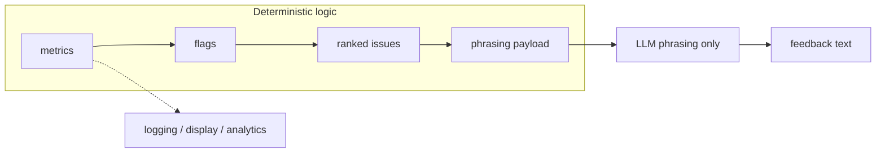

# OpenAI Coaching Pipeline (Revised Plan)

**Principle:** LLM is used only for **natural phrasing**, **combining cues**, and **personalization/tone**. It must **not** decide what’s wrong or interpret raw pose/metrics.

**Correct pipeline:**  
`pose → metrics → flags → ranked issues → phrasing payload → LLM phrasing`



---

## Revision 1: Single Source of Truth

Define a **shared contract** for issue names, metric definitions, thresholds, and priority rules. Swift and Python may implement separately, but the contract (IDs, structure, semantics) must be identical.

### Contract format (canonical spec, e.g. JSON/YAML in repo)

**Issue definition:**

| Field | Description | Example |
|-------|-------------|--------|
| `issue_code` | Stable ID (snake_case) | `insufficient_depth` |
| `display_name` | Human-readable label | `Insufficient Depth` |
| `severity` | `high` \| `medium` \| `low` | `high` |
| `cue` | Default coaching cue text | `Sit deeper until hips reach knee level` |
| `exercise_scope` | Optional: which exercises (e.g. squat, bench) | `squat` |

**Metric definition:**

| Field | Description | Example |
|-------|-------------|--------|
| `metric_id` | Stable ID | `depth`, `back_angle`, `knee_alignment` |
| `unit` / `range` | How to interpret values | 0–1, degrees, etc. |
| `thresholds` | Map from threshold ID to numeric value | `depth_shallow: 0.35`, `depth_good: 0.6` |

**Priority rules:**

- Define which issue wins when multiple are present (e.g. depth over knee alignment when both fire).
- Stored in the same spec (e.g. ordered list of `issue_code` by priority, or explicit rules).

**Deliverable:** One canonical file (e.g. `docs/coaching_contract.json` or `coaching_contract.yaml`) that both iOS and cloud reference. Implementations in Swift and Python must stay in sync with this contract.

**Minimal contract example (structure only):**

```json
{
  "issues": [
    {
      "issue_code": "insufficient_depth",
      "display_name": "Insufficient Depth",
      "severity": "high",
      "cue": "Sit deeper until hips reach knee level",
      "exercise_scope": "squat"
    },
    {
      "issue_code": "knee_valgus",
      "display_name": "Knees Caving In",
      "severity": "medium",
      "cue": "Push your knees out over your toes",
      "exercise_scope": "squat"
    }
  ],
  "priority_order": ["insufficient_depth", "forward_lean", "knee_valgus", "knee_varus"],
  "metrics": {
    "depth": { "range": [0, 1], "thresholds": { "shallow": 0.35, "good": 0.6 } },
    "back_angle": { "unit": "degrees", "thresholds": { "forward_lean": 35 } }
  }
}
```

---

## Revision 2: Deterministic Logic Layer (Ranked Issues → Phrasing Payload)

Add an explicit layer: **metrics → flags → ranked issues → phrasing payload**.

- **Flags:** Boolean or categorical outputs from thresholds (e.g. `depth_low`, `back_angle_high`, `knee_valgus`).
- **Ranked issues:** Apply priority rules to choose **primary** and optionally **secondary** issue; decide when to **suppress** minor issues (e.g. only one issue if severity is high).
- **Praise-only:** When no issues above threshold, or when logic explicitly says “praise only,” output a payload with no primary/secondary issue and only a positive note.

**Phrasing payload (compact, semantic only):**

```json
{
  "primary_issue": "insufficient_depth",
  "secondary_issue": "knees_caving_in",
  "positive_note": "rep rhythm looked controlled",
  "rep_count": 8
}
```

- `primary_issue` / `secondary_issue`: use **stable issue_code** from contract (or `null`).
- `positive_note`: short, deterministic note when applicable (e.g. “tempo stayed controlled”, “good depth”).
- Logic layer also encodes **when to suppress** (e.g. no secondary if primary is high severity) and **when to give praise only** (no issues, only positive_note).

This payload is the **only** input to the LLM for phrasing. No raw metrics in the payload.

---

## Revision 3: No Raw Numbers in Phrasing Input

Do **not** pass raw metrics (depth, back_angle, knee_alignment, etc.) into the LLM prompt. Passing numbers tempts the model to reinterpret them.

- **Use for phrasing:** Only the **compact semantic phrasing payload** (primary_issue, secondary_issue, positive_note, rep_count, and optionally severity / feedback_state; see Revision 4).
- **Use metrics for:** Logging, display, analytics, threshold tuning, and QA. Keep metrics in app/cloud logic and in API responses for debugging and UI; do not feed them into the LLM as the source of “what to say.”

Example of what **not** to send:

```json
{ "depth": 0.71, "back_angle": 42.8, "knee_alignment": -0.14, "issues": [...] }
```

Example of what **to** send:

```json
{
  "primary_issue": "insufficient_depth",
  "secondary_issue": null,
  "positive_note": "tempo stayed controlled",
  "rep_count": 8,
  "severity": "moderate"
}
```

(Plus any feedback_state when confidence is low or feedback is suppressed; see Revision 4.)

---

## Revision 4: Confidence and “No Feedback” States

The logic layer must support **low-confidence** and **no-feedback** outcomes so the system can avoid over-interpreting bad or sparse data.

**States to support (examples):**

| State / flag | Meaning |
|--------------|--------|
| `confidence_low` | Metrics exist but are unreliable (e.g. jitter, partial visibility). |
| `insufficient_visibility` | Pose not visible enough to assess form. |
| `too_few_reps` | Not enough reps to give meaningful feedback. |
| `metrics_inconclusive` | Data doesn’t clearly indicate an issue or praise. |

**Behavior:**

- When any of these apply, the **phrasing payload** should reflect it (e.g. a `feedback_state` or `confidence` field), and the LLM prompt should instruct the model to produce a **short, safe, generic** line (e.g. “Good set. When you’re ready, start your next set.”) or to **not** invent form feedback.
- Optionally, the app can skip the LLM and use a fixed fallback string when `feedback_state` is one of the above.

**Example phrasing payload with state:**

```json
{
  "primary_issue": "insufficient_depth",
  "secondary_issue": null,
  "positive_note": "tempo stayed controlled",
  "rep_count": 8,
  "severity": "moderate"
}
```

**Example when no form feedback should be given:**

```json
{
  "feedback_state": "too_few_reps",
  "rep_count": 2,
  "primary_issue": null,
  "secondary_issue": null,
  "positive_note": null
}
```

**Allowed `feedback_state` values (from contract):**  
`confidence_low` | `insufficient_visibility` | `too_few_reps` | `metrics_inconclusive` | `null` (normal form feedback).

Metrics (raw or aggregated) remain available for **logging, display, analytics, threshold tuning, and QA** — not for phrasing content beyond what the logic layer encodes in the payload.

---

## Revision 5: Standardize Issue Naming (Stable IDs)

Do **not** use raw display strings everywhere (e.g. `"Insufficient Depth"`, `"Knees Caving In"`). They are fragile and differ across locales/contexts.

**Use stable machine IDs everywhere in logic and APIs:**

| Stable ID (`issue_code`) | Display name (mapped from contract) |
|--------------------------|-------------------------------------|
| `insufficient_depth` | Insufficient Depth |
| `forward_lean` | Forward Lean |
| `knee_valgus` | Knees Caving In |
| `knee_varus` | Knees Bowing Out |
| `grip_too_wide` | Grip Too Wide |
| `elbows_flaring` | Elbows Flaring |
| `incomplete_rom` | Incomplete ROM |
| `eccentric_too_fast` | Eccentric Too Fast |
| `concentric_too_slow` | Concentric Too Slow |

- **In code and API:** Use only `issue_code` (e.g. `insufficient_depth`).  
- **Display (UI, logs for humans):** Map `issue_code` → `display_name` (and optionally `cue`) via the shared contract.  
- **Phrasing payload:** Use `issue_code` in `primary_issue` / `secondary_issue`. The LLM can receive the contract’s `display_name` and `cue` for those codes so it can phrase naturally without reinterpreting metrics.

---

## Implementation Summary

1. **Add canonical contract**  
   - One file (e.g. `docs/coaching_contract.json`): issue codes, display_name, severity, cue, metric definitions, thresholds, priority rules.  
   - Swift and Python implementations must align with this contract.

2. **Pipeline in both iOS and cloud**  
   - **Metrics** (from pose) → **Flags** (threshold checks) → **Ranked issues** (primary/secondary, suppress/praise-only by rules) → **Phrasing payload** (issue codes, positive_note, rep_count, severity, feedback_state).  
   - **Phrasing payload only** (no raw numbers) → LLM for natural phrasing.

3. **Confidence and no-feedback**  
   - Logic layer sets `feedback_state` (e.g. `confidence_low`, `insufficient_visibility`, `too_few_reps`, `metrics_inconclusive`) and passes it in the payload; phrasing or fallback respects it.

4. **Issue naming**  
   - Replace all raw strings with `issue_code` in logic and APIs; add a single mapping (contract) from `issue_code` to `display_name` and `cue` for UI and LLM.

5. **LLM prompt**  
   - Input: phrasing payload (+ contract snippet for display_name/cue of referenced issue codes if desired).  
   - Instruction: only phrase; do not assess, interpret metrics, or add new issues.

---

## Files to Touch (Revised)

| Location | Action |
|----------|--------|
| **New: `docs/coaching_contract.json` (or .yaml)** | Single source of truth: issue_code, display_name, severity, cue; metric definitions; thresholds; priority rules. |
| **Cloud `main.py`** | Implement metrics → flags → ranked issues (using contract) → phrasing payload; add confidence/no-feedback states; `get_phrased_feedback(payload)` with no raw metrics; return payload/feedback in API. |
| **iOS `OnDevicePoseManager`** | Use issue_code from contract in `FormAnalysis` and in all logic; map to display only at UI boundary. Implement flags → ranked issues → phrasing payload; add confidence/no-feedback. |
| **iOS `OpenAICoachingManager`** | Accept phrasing payload (or FormAnalysis that now carries payload + issue_codes); prompt from payload + contract only; document “phrasing only.” |
| **FirebaseManager** | Use cloud-returned phrasing payload / feedback; if second LLM call kept, pass only payload (no raw metrics); use issue_codes and feedback_state. |

No raw strings for issues in logic; no raw metrics in phrasing input; one contract, one pipeline shape (metrics → flags → ranked issues → phrasing payload → LLM).
